

  
# Indoor Positioning System (IPS)

 

**Electronics • Embedded Systems • BLE • RFID • PCB Design • Altium Designer • RTLS • Indoor Positioning Systems**

 

*2nd year Engineering Project - Electronic and Automatic Systems Engineering*  
*ENSA Tangier · 2021–2022*

GPS signals are generally unavailable or unreliable inside buildings, which is why **Indoor Positioning Systems (IPS)** are used to determine the location of objects or people in environments where satellite-based positioning cannot operate reliably.

This project explores two distinct approaches for indoor localization and tracking:

- an **UHF RFID-based tracking system**, using passive UHF RFID tags, a fixed RFID reader, and an **ESP8266** for communication and data transmission;
- a **Bluetooth Low Energy (BLE)-based localization system**, using RSSI measurements, dynamic radio-channel calibration, distance estimation, trilateration, and an **ESP32-based custom hardware platform**.

The two approaches address indoor positioning from different perspectives.  
The RFID system focuses on detecting and tracking tagged objects through known reader coverage areas, while the BLE system estimates the position of a target using radio-signal measurements.

## Studied Approaches

### UHF RFID Tracking

The first concept is based on **passive UHF RFID technology**.

  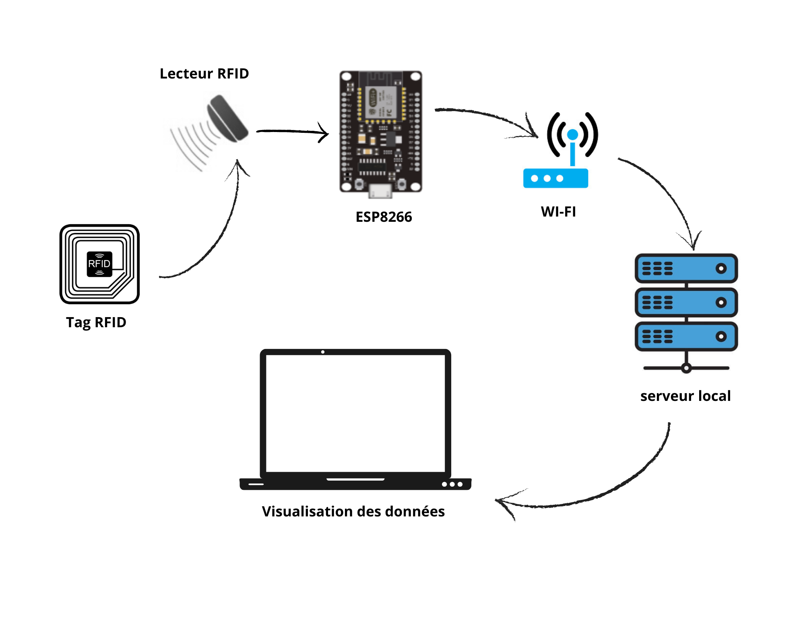

  <em>UHF RFID tracking system architecture.</em>

 

Passive RFID tags attached to objects are detected by fixed UHF RFID readers installed at predefined locations. When a tag enters the reader's coverage area, the reader retrieves its unique identifier.

The RFID reader communicates with an **ESP8266** through an **RS232-to-TTL converter**. The ESP8266 then uses Wi-Fi connectivity to transmit the detected tag information toward a local server, where the data can be stored, processed, and visualized.

This architecture provides a way to identify tagged objects and monitor their movement through known indoor detection areas.

### BLE Indoor Localization

The second concept is based on **Bluetooth Low Energy (BLE)** and aims to estimate the position of a target inside an indoor environment.

  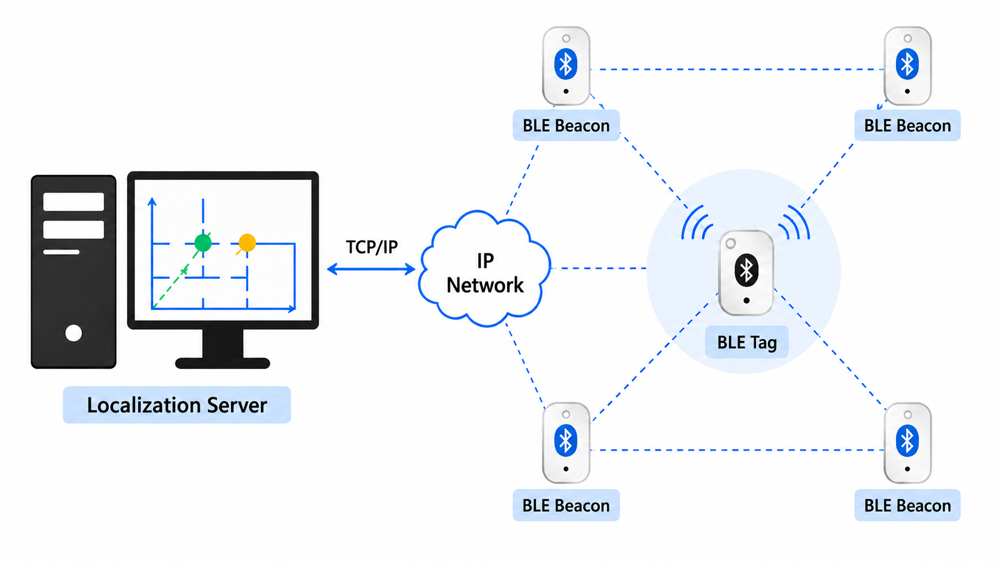

  <em>BLE localization process based on calibration, ranging and positioning.</em>

The system uses a BLE transmitter associated with the target and **three fixed BLE anchors** whose positions are known.

The anchors measure the received signal strength (**RSSI**) from the target. Since RSSI values are strongly affected by the indoor environment, the proposed method first performs a dynamic calibration of the radio-propagation parameters.

The calibrated RSSI measurements are then converted into estimated distances between the target and each anchor. These distances are finally processed using **2D trilateration** to estimate the position of the target as coordinates `(x, y)`.

An **ESP32** was selected as the hardware platform for the BLE system because it integrates BLE and Wi-Fi capabilities and can be used as the basis of the localization node.

## System Concepts

### UHF RFID System Concept

The UHF RFID system is based on the detection of passive RFID tags by readers positioned at known locations.

  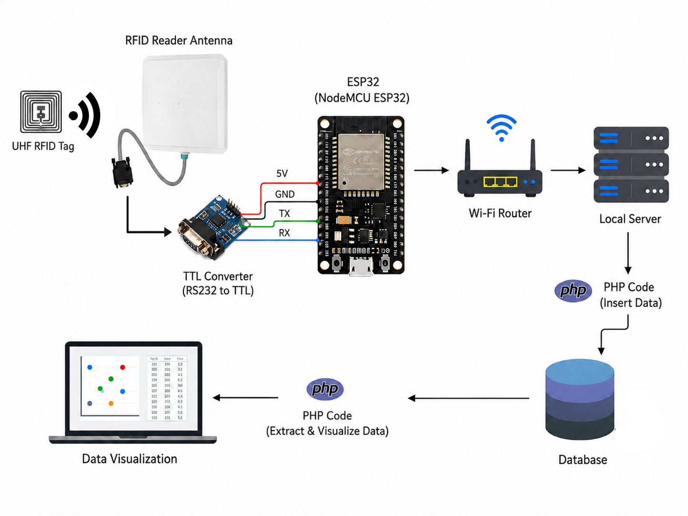

The main operating sequence is:

`Passive UHF RFID Tag → UHF RFID Reader → RS232/TTL → ESP8266 → Wi-Fi → Local Server → Database / Visualization`

The RFID reader continuously interrogates its surrounding area. When a passive tag enters the reading zone, the electromagnetic field generated by the reader activates the tag, which returns its stored identifier through backscatter communication.

The detected information is transferred from the RFID reader to the ESP8266 through a serial interface. Since the reader uses RS232 signaling levels and the ESP8266 operates with TTL-compatible logic levels, an RS232-to-TTL converter is used between them.

The ESP8266 then provides the network connection required to transmit the detection information to the software layer.

### BLE Localization System Concept

>

The BLE localization system follows a ranging-based positioning approach.

Each BLE beacon is built around an **ESP32**, which provides the Bluetooth Low Energy communication required for RSSI measurements. The beacon is powered by a rechargeable Li-Po battery and includes dedicated battery charging and protection circuitry to support autonomous operation.

  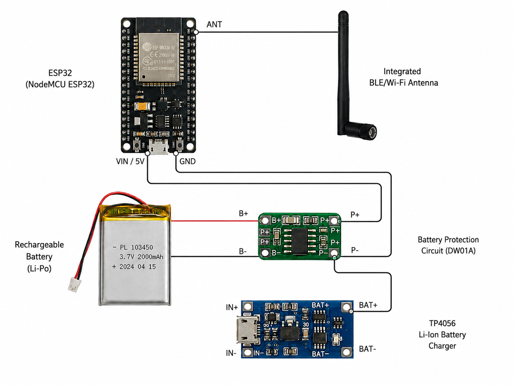

  

  <em>Main hardware components of the BLE beacon.</em>

The main localization processing chain is:

`BLE Target → RSSI Measurements → Dynamic Calibration → Distance Estimation → Trilateration → Position (x, y)`

Three BLE beacons are installed at known coordinates within the localization area. The received signal strength between the target and each beacon is measured using **RSSI**.

Because indoor radio propagation is affected by obstacles, multipath propagation, furniture, and human movement, a calibration stage is used to estimate the propagation characteristics of the environment.

The calibrated propagation model is then used to convert each RSSI measurement into an estimated target-to-beacon distance.

Once the three distances are estimated, **2D trilateration** is applied to determine the position of the target.

Because indoor radio propagation changes with obstacles, multipath effects, furniture and human movement, a calibration stage is used to estimate the propagation parameters of the environment.

The calibrated propagation model is then used to transform each RSSI measurement into a target-to-anchor distance.

Once the three distances are estimated, 2D trilateration is applied to determine the target coordinates.

## Hardware Design

The hardware development focused on translating the proposed system architectures into practical embedded platforms.

### BLE Localization Board

For the BLE localization system, a dedicated **IPS-BLE PCB** was designed using **Altium Designer**.

The board integrates the main electronic functions required by the BLE node:

- **ESP32** processing and wireless communication
- Rechargeable **Li-Po battery** supply
- **TP4056** battery charging circuit
- Battery protection circuitry
- Power distribution
- Input/output connections

The PCB was developed to consolidate these functions into a single hardware platform suitable for the BLE localization nodes.

#### Schematic

  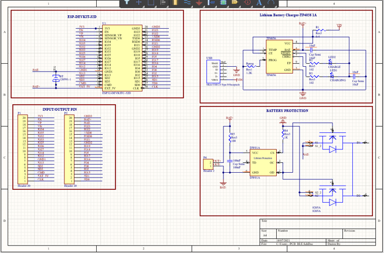

  <em>Complete schematic of the IPS-BLE board.</em>

  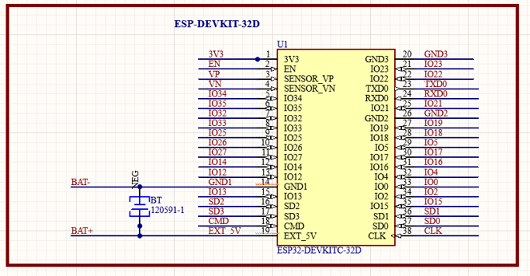

  <em>Figure 44 — ESP32 and battery interface schematic.</em>

  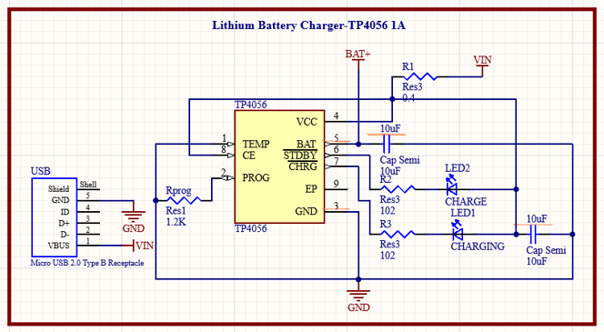

  <em>Figure 46 — TP4056 Li-Ion battery charger schematic.</em>

  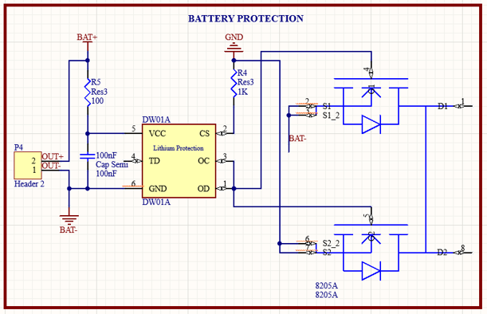

  <em>Figure 47 — Li-Ion battery protection circuit schematic.</em>

#### PCB Layout

  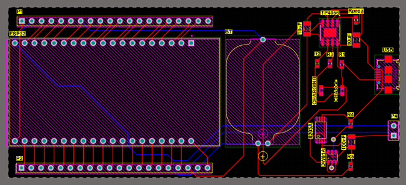

  <em>2D PCB layout of the IPS-BLE board designed with Altium Designer.</em>

#### 3D PCB Representation

<table>
<tr>
<td align="center">
  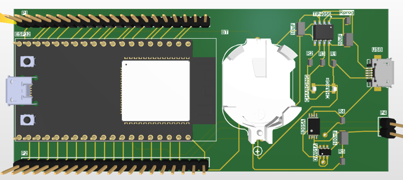 
  <em>Top view</em>
</td>
<td align="center">
  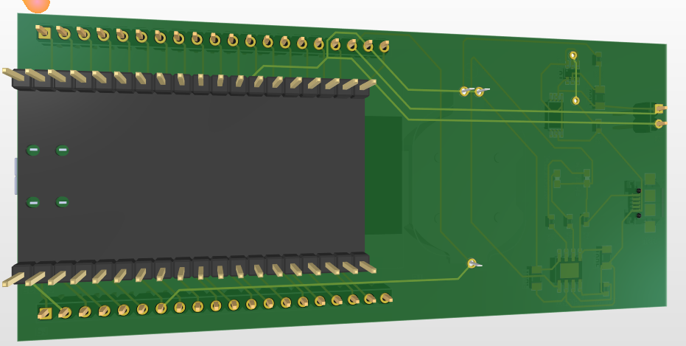 
  <em>Bottom view</em>
</td>
</tr>
</table>

### UHF RFID Hardware

The UHF RFID architecture uses modular hardware consisting of a **long-range UHF RFID reader, an RS232-to-TTL interface, and an ESP8266**.

Unlike the BLE nodes, which required a compact battery-powered embedded platform, the RFID hardware is based on larger, self-contained modules intended for fixed installation. Consequently, no dedicated PCB was required for this architecture.
